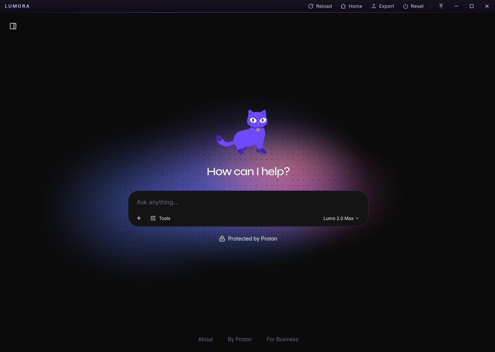

# Lumora



Unofficial Linux desktop client for [Proton Lumo](https://lumo.proton.me), built with Tauri v2 on WebKitGTK. The Lumo web client does all the actual work while Lumora hosts it in a native window and adds the conveniences a browser tab doesn't have.

Not affiliated with or endorsed by Proton AG. I made this for myself, but you're welcome to use it. Report any issues you run into.

## Features

- Persistent login (survives restarts)
- Frameless window with a custom titlebar themed to match Lumo
- System tray: closing the window hides it, left click toggles it, quit from the tray menu
- Global hotkey `Ctrl+Alt+L` to summon the window
- Export the current conversation to clipboard, `.txt` (saved to Downloads) or PDF (via print)
- Navigation is locked to Proton domains, external links open in your default browser
- Window size and position are remembered

Keyboard: `Ctrl+R` reload, `F11` fullscreen, `Ctrl+Alt+L` show window.

## Building

Requires Rust (stable) and WebKitGTK 4.1. On Arch-based distros:

```sh
sudo pacman -S --needed webkit2gtk-4.1 base-devel openssl librsvg libappindicator-gtk3
```

Then:

```sh
cd src-tauri
cargo run
```

The first build compiles around 450 crates and takes a few minutes. After that it is fast. No Node.js involved.

## Packaging (AppImage)

```sh
cargo install tauri-cli --locked
cd src-tauri
NO_STRIP=1 cargo tauri build
```

`NO_STRIP=1` is required on Arch-based systems because linuxdeploy's bundled `strip` doesn't understand the `.relr.dyn` sections in current system libraries. If linuxdeploy itself fails to start, also set `APPIMAGE_EXTRACT_AND_RUN=1`. The output lands in `src-tauri/target/release/bundle/appimage/`.

## Notes and known limitations

- **WebKitGTK WASM workaround:** the app sets `JSC_useWasmIPInt=0` at startup. WebKitGTK 2.50's in-place WASM interpreter crashes with a fatal assert (`ipint_reserved_0xcb_validate`) in Proton's post-login crypto, killing the web process right after 2FA. Forcing the older WASM tiers avoids it. Found via coredump backtrace. Can be removed once fixed upstream.
- **Wayland:** always-on-top and the global hotkey depend on the compositor. On KDE Wayland, use a window rule (Keep Above) and a compositor-side shortcut if the in-app ones don't take effect. Both work on X11.
- **Export is DOM scraping.** It reads the decrypted conversation from the rendered page, since Lumo has no public API. Selectors live in `src-tauri/src/inject.js` and will need updating when Proton changes the client's markup.
- **The `identifier` in `tauri.conf.json` names the profile directory** (`~/.local/share/com.lumora.desktop`). Changing it later logs you out.
- The remote page gets a deliberately small set of native permissions (window controls, clear browsing data, event bus). See `src-tauri/capabilities/default.json`.

A note on code style: braces are on the same line throughout because the IDE kept reformatting the files and I eventually let it win.